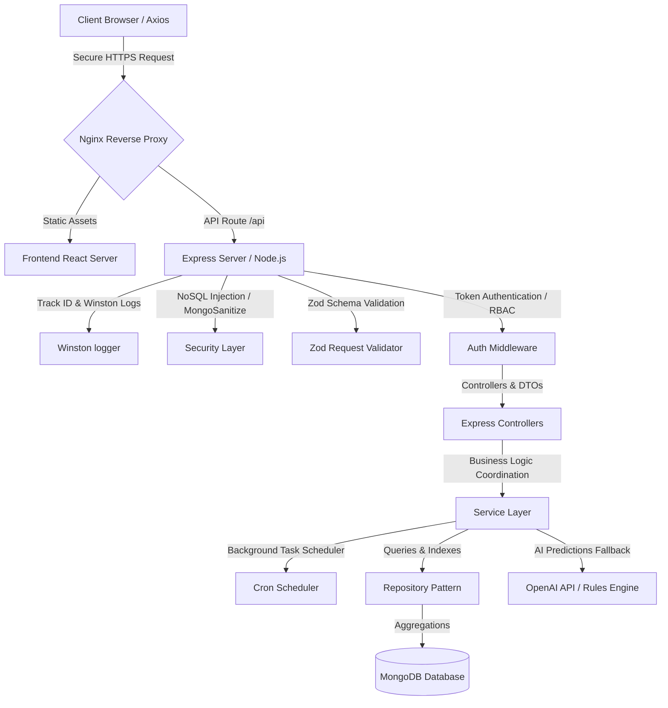

# FinanceSaaS - AI-Powered Full-Stack Wealth & Finance Tracker

FinanceSaaS is a production-grade, enterprise-scale AI-powered fintech application designed for personal asset tracking and analytics. Built with **React 18, Vite, TypeScript, Node.js, Express, and MongoDB**, it features a beautiful glassmorphism dark-theme dashboard, JWT refresh token rotation cookies, interactive charts, automated AI transaction categorization, spending heatmaps, savings goal target timelines, and financial forecasting engines.

---

## 🏗️ System Architecture & Data Flow



---

## 🌟 Advanced Features

### 🔐 High-Fidelity Security & Auth
*   **JWT Auth with Cookie-Based Rotation:** Implements secure short-lived access tokens (15m expiration) alongside HTTP-only, SameSite=Strict refresh tokens (7d expiration) in the backend to ensure high security against XSS.
*   **Token Rotation & Reuse Detection:** Prevents session hijacking. If a refresh token is reused, all refresh tokens associated with that user's family are immediately invalidated.
*   **Strict Zod Validation & Request Sanitation:** Enforces type safety at runtime. Prevents parameters injection via custom Zod schemas.
*   **NoSQL Injection & XSS Defense:** Uses `express-mongo-sanitize` and `helmet` headers to secure database queries against malicious payloads.

### 📊 Advanced Aggregations & DB Performance
*   **MongoDB Aggregation Pipelines:** Replaces slow Node.js loop aggregations. Generates statistics, category breakdowns, and monthly trends directly in the MongoDB layer using a single `$facet` pipeline, significantly boosting read speeds.
*   **Optimized Database Indexes:** Implements compound indexing (`{ user: 1, date: -1 }`, `{ user: 1, category: 1 }`) to ensure fast table scans for scalable ledgers.

### 🤖 AI Insight Analytics
*   **Mock AI Analytics Engine (Recruiter Mode):** When no `OPENAI_API_KEY` is present, a local rules-based engine triggers realistic statistical anomalies, budget overruns, and milestone projections, removing setup friction.
*   **Goal Achievement Predictor:** Computes specific dates savings goals will be completed based on the user's monthly net surplus speed.
*   **Strategic Spending Anomalies:** Flags expenses that deviate by more than 2 standard deviations from the category's typical historical average.

### 💼 Portfolio & SaaS Core Operations
*   **CSV Bulk Imports:** Supports bulk transaction creation by uploading CSV spreadsheets processed and mapped client-side.
*   **Client-Side PDF Exporter:** Generates print-ready financial statements using clean HTML and styling formats.
*   **Multi-Currency Support:** Dynamically switches settings between USD ($), EUR (€), GBP (£), and INR (₹), updating the client state instantly.
*   **Recurring Transactions Scheduler:** Registers repeating bills or paychecks (daily, weekly, monthly, yearly) and copies them into standard logs using a background worker.

---

## 🗄️ Database Schemas

### 1. `Transaction`
```typescript
{
  user: mongoose.Schema.Types.ObjectId, // ref: 'User'
  amount: Number,
  category: String,
  description: String,
  type: 'income' | 'expense',
  date: Date,
  tags: [String],
  notes: String,
  createdAt: Date
}
```

### 2. `RecurringTransaction`
```typescript
{
  user: mongoose.Schema.Types.ObjectId, // ref: 'User'
  amount: Number,
  category: String,
  description: String,
  type: 'income' | 'expense',
  frequency: 'daily' | 'weekly' | 'monthly' | 'yearly',
  startDate: Date,
  lastTriggered: Date,
  nextOccurrence: Date,
  tags: [String],
  notes: String,
  isActive: Boolean,
  createdAt: Date
}
```

---

## 🚀 Getting Started Locally

### Prerequisites
*   Node.js (v18+)
*   MongoDB running locally (or MongoDB Atlas URI)

### 1. Environment Configurations
Create a file at `env/.env` and insert your credentials:
```env
PORT=5000
MONGO_URI=mongodb://localhost:27017/finance_tracker
JWT_SECRET=super_secret_finance_tracker_key_123456
JWT_REFRESH_SECRET=super_secret_refresh_key_987654
NODE_ENV=development
# Optional: OPENAI_API_KEY=your_openai_api_key
```

### 2. Seed & Initialize Database
Install dependencies and run the seed script to create a demo account:
```bash
cd Backend
npm install
node seed.js
```
*   **Demo Username:** `demo@example.com`
*   **Password:** `password123`

### 3. Launch Development Servers
**Backend:**
```bash
cd Backend
npm run dev
# API listens on http://localhost:5000. Interactive Swagger UI is available at http://localhost:5000/api-docs
```

**Frontend:**
```bash
cd Frontend
npm install
npm run dev
# Client runs on http://localhost:5173
```

---

## 🐳 Docker Deployment (Nginx Reverse Proxy)

Launch the full-stack system locally using the multi-stage Docker configurations:
```bash
docker-compose up --build
```
*   **Frontend Web App:** `http://localhost` (served by Nginx routing `/api` requests to Express on port 5000)
*   **MongoDB port:** `27017`

---

## ☁️ Production Deployment Guide

### Option A: VPS Hosting (Ubuntu, Nginx, Systemd)
1.  **Clone & Build Assets:**
    ```bash
    git clone https://github.com/your-username/finance-tracker.git /var/www/finance-tracker
    cd /var/www/finance-tracker/Frontend
    npm install && npm run build
    ```
2.  **Setup PM2 to Keep Backend Alive:**
    ```bash
    npm install -g pm2
    cd ../Backend
    npm install
    pm2 start app.js --name "finance-backend"
    pm2 save && pm2 startup
    ```
3.  **Configure Nginx Reverse Proxy (`/etc/nginx/sites-available/default`):**
    ```nginx
    server {
        listen 80;
        server_name yourdomain.com;

        # Frontend assets
        location / {
            root /var/www/finance-tracker/Frontend/dist;
            index index.html;
            try_files $uri $uri/ /index.html;
        }

        # Backend api proxy
        location /api {
            proxy_pass http://localhost:5000;
            proxy_http_version 1.1;
            proxy_set_header Upgrade $http_upgrade;
            proxy_set_header Connection 'upgrade';
            proxy_set_header Host $host;
            proxy_cache_bypass $http_upgrade;
        }
    }
    ```
4.  **Restart Nginx:** `sudo systemctl restart nginx`

### Option B: AWS ECS Deployment (Fargate + Atlas)
1.  Set up a MongoDB Atlas cluster and acquire the connection URI.
2.  Create an AWS ECR (Elastic Container Registry) repository.
3.  Build and push Docker containers to AWS ECR.
4.  Launch an ECS Task Definition under **Fargate**, specifying container ports:
    *   `Frontend`: Port `80` (expose to Load Balancer)
    *   `Backend`: Port `5000` (internal network routing)
5.  Set environment credentials in ECS task variables (`MONGO_URI`, `JWT_SECRET`, `NODE_ENV=production`).

---

## 🧪 Testing

The backend includes test coverage for controllers and API routing:
```bash
cd Backend
npm test
```
*(Tests are executed using Jest and Supertest, stubbing database and AI services to run cleanly in CI/CD workflows).*
